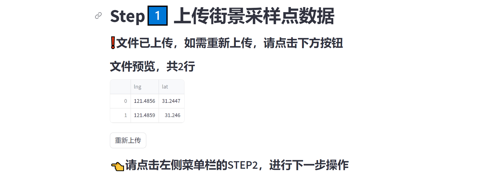

# :house_with_garden: 百度街景数据采集+街景语义分割工具

## :one: 作者信息

姓名：来陈璐<br>
班级：21级地理科学拔尖班

## :two: 项目简介
随着城市化进程的不断推进，城市宜居性越来越受到人们的重视，越来越多的科学证据表明，城市建成环境在影响人类健康上发挥着重要作用。街道作为城市的基础单元，受到了众多研究者的关注；其中，<b><font color=#186cb0>街景图像（Street View Image）</font> </b>是研究街道品质的重要数据来源，可以直观反映街道提供的视觉信息。

<b>但是，对于缺乏编程经验的研究者而言，获取街景图像，并从图像中获取街道评价指标具有一定的难度。</b>

首先需要熟悉网络爬虫方法；其次，为了从图像中获取准确的语义信息（也就是街景数据中主要包含的视觉信息），需要在本地部署深度学习框架，并学习相应的代码文档。

因此，本项目针对该痛点，开发了一个<b><font color=#186cb0>交互式网页</font></b>，便于研究者获取<b><font color=#186cb0>街景图像</font></b>，并根据街景图像得到常用的街道评价指标（<b><font color=#186cb0>绿视率和天空率</font></b>）。最重要的是，交互式网页<b>避免了繁琐的代码部署过程</b>，使得数据获取更加简单快捷。

## :three: 环境依赖 - 技术路线
### 3.1 环境依赖

项目语言为 **Python** :snake: <br>
建议打开<b><font color=#186cb0>VPN</font></b>，以免网页无法正常加载

| 1. 网页部署      | 2. 街景数据采集 | 3. 语义分割  |
| ---------------- | --------------- | ------------ |
| Streamlit        | Requests        | NumPy 1.23.5 |
| Streamlit-folium | Pillow          | MXNet        |
|                  |                 | GluonCV      |

### 3.2 关于语义分割 
<b>语义分割（Semantic Segmentation）</b>是计算机视觉领域的一个重要研究方向，其目的是将图像中的每个像素点分配到特定的类别中，从而实现对图像的像素级别的理解。

<b>语义分割</b>的结果可以用于计算<b><font color=#186cb0>绿视率</font></b>和<b><font color=#186cb0>天空率</font></b>，具体计算方法如下：

- <b><font color=#186cb0>绿视率</font></b>：街景图像中植被像素点的数量占总像素点的比例。
- <b><font color=#186cb0>天空率</font></b>：街景图像中天空像素点的数量占总像素点的比例。

本项目使用的是在Cityscapes数据集上预训练的<b><font color=#186cb0>DeepLabV3</font></b>模型，以<b><font color=#186cb0>ResNet101</font></b>作为backbone，在<b><font color=#186cb0>街景图像</font></b>上的语义分割效果较好。

如果您希望更换预训练模型，可以在[项目仓库](https://github.com/Antonia-Lake/Street-View-AOI-Spider)下载项目源代码，并参考[GluonCV](https://cv.gluon.ai/model_zoo/segmentation.html)官方文档，更换预训练模型。

## :four: 项目功能

### 4.1 使用说明
- 用户可以使用示例数据；如果想使用个人数据，需要上传街景图像的<b>经纬度位置（点数据）</b>，文件格式为<b><font color=#478e68>CSV</font></b> 或 <b><font color=#478e68>GeoJSON</font></b> <br>
:exclamation: 注意，不建议一次上传大于100个点数据，以免被接口被封禁 :exclamation:


- 上传数据后，需要在Step2页面确认采样点信息


- 之后用户可以选择需要采集的街景方位，并设置采样间隔，获取街景图像


- 采集数据后，使用<b>语义分割模型</b>对街景图像进行分割，得到街景中的语义内容，并<b>计算绿视率和天空率</b>


- 最后，用户可以<b>点击下载</b>采集的街景数据、语义分割结果、绿视率和天空率


- 下图为获得的街景和语义分割图像，以及在原始数据的基础上添加了各个方向的绿视率和天空率


### 4.2 项目稳定性说明

<b>当用户未按照要求操作时，会在页面中提示错误信息，提醒用户按照正确流程操作，避免程序崩溃。</b> 

<b>以下为部分错误的提示信息：</b>

- 当用户未完成上一步，就进入下一页面时，会在页面中要求用户返回上一步


- 当用户上传<b>空文件、非Point类型的GeoJSON、不包含经纬度信息的CSV文件</b>时，都会在页面中提示错误信息，并要求用户重新上传


- 当用户在Step1上传数据后，会提醒用户不要重复上传；如需重新上传，需要先点击“重新上传”按钮



- 为避免用户上传GeoJSON时，没有注意坐标系，程序会自动将坐标系转换为WGS84


## :five: 如果您对该项目感兴趣

- 您可以访问我的[项目仓库](https://github.com/Antonia-Lake/Street-View-AOI-Spider)，查看源代码
- 如果您希望对该项目进行改进，欢迎fork项目并提交pull request
- 如果您希望将项目部署到本地
    - 建议使用`conda`创建虚拟环境，建议Python版本为3.9
    - 您可以使用以下命令安装创建虚拟环境，并安装项目所需的依赖包
    ```cmd
    conda create -n streetview python=3.9
    pip install -r requirements.txt
    ```

#### 关于MXNet配置的注意事项

如果在配置`MXNet`库时出现了`NumPy`库的错误，建议按照以下方法解决：

> I think that if you're using pip, the latest available version of MXNet on Windows is 1.8. So I found that you can install this version of MXNet with `numpy==1.23.5`   [From StackOverFlow](https://stackoverflow.com/questions/65325177/how-to-solve-numpy-error-while-installing-mxnet)

```py
pip install numpy==1.23.5
pip install mxnet -f https://dist.mxnet.io/python/cpu
```

